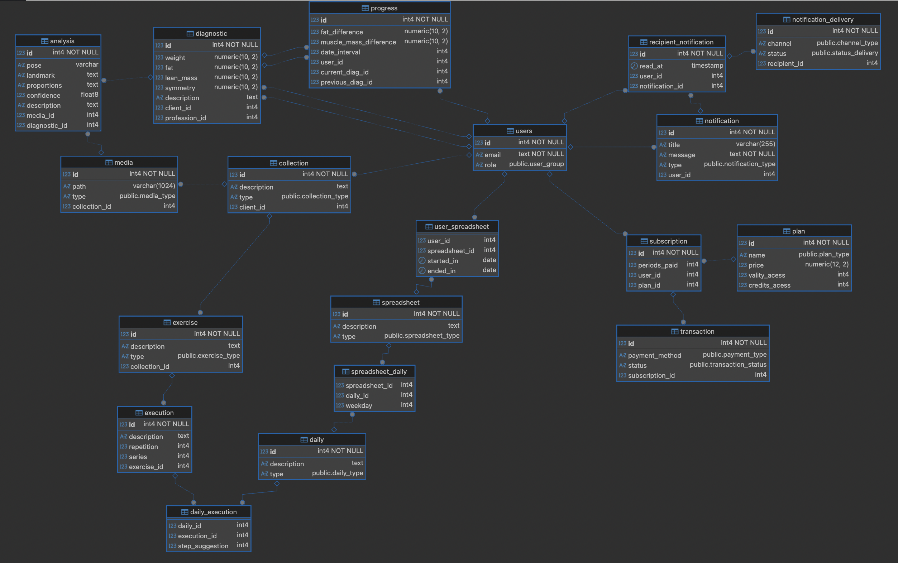

# Model - Database v4

# Diagrama

```
- Nota - v1: 
A princípio, a ideia do projeto não precisa de uma estrutura complexa de tabelas (na minha visão), portanto a estrutura idealizada em sala já estava muito boa.
O que busquei pesquisar foi alguma plataforma que tivesse uma proposta de estrutura de banco de dados parecida com a nossa, e cheguei ao design do banco de dados do Instagram, onde você possui posts e cada post possui arquivos de imagem/vídeo, e esses arquivos de mídia possuem comentários.
Por mais que a proposta final seja diferente, a estrutura utilizada é similar ao que buscamos (na minha visão), e portanto acredito que seja um bom exemplo a se seguir.

- Nota - v2:
Foi realizada a implementação inicial do Schema de notificações, estruturado com base nas novas referencias listadas.

- Nota - v3:
Foi adicionado o design inical de inscrições nos planos. Não identifiquei tanto conteudo assim para este tópico, mas o artigo adicionado abaixo ajudou a idealizar o restante por conta própria.

- Nota - v4:
Adicionada as tabelas relacionadas a planilhas de treino citadas na documentação inicial do github. 
```

## Explicação Resumida
* Users 

| Tabela de usuários e seus papéis
```sql
    create type user_group as enum (
        'client', 'admin', 'professional'
    );

    create table users (
        id INT generated always as identity primary key,
        email TEXT unique not null,
        role user_group

        -- demais atributos a serem adicionados
    );
```

* Collection

| Grupo de fotos e vídeos enviados pelo usuário (pode ser imaginado como um post no Instagram, onde você pode postar uma simples foto ou fazer um carrossel).
```sql
    create table collection ( -- grupo de arquivos de midia
        id INT generated always as identity primary key,
        description TEXT,
        
        client_id INT references users(id)
    );
```

* Media

| Arquivo unitário. Se collection é o grupo de arquivos, aqui ficará apenas a referência de um arquivo.
```sql
    create type media_type as enum (
        'image', 'video'
    );

    create table media ( -- unidade de arquivo de midia
        id INT generated always as identity primary key,
        path VARCHAR(1024),
        type media_type,
        
        collection_id INT references collection(id)
    );
```

* Analysis

| Pense em Analysis como o par da tabela Media. Aqui será feita a análise de cada foto/vídeo enviado.
```sql
    create table analysis ( -- analise unitaria de cada imagem/video 
        id INT generated always as identity primary key,
        pose VARCHAR, -- maybe can be ENUM
        landmark TEXT, -- pontos de referencia gerados pela IA (se necessário)
        proportions TEXT, -- proporcoes do corpo
        confidence float, -- precisao nas analises
        description TEXT,
        
        media_id INT references media(id),
        diagnostic_id INT references diagnostic(id)
    );
```

* Diagnostic

| Se a tabela Analysis é o par da tabela Media, a tabela Diagnostic é o par da tabela Collection. Aqui nós iremos pegar todas as análises unitárias feitas para cada arquivo de mídia e gerar um resultado final (diagnóstico).
```sql
    create table diagnostic ( -- diagnostico gerado a partir da colecao de analises 
        id INT generated always as identity primary key,
        weight numeric(10,2), -- peso
        fat numeric(10,2), -- gordura corporal
        lean_mass numeric(10,2), -- massa magra
        symmetry numeric(10,2), 
        description TEXT,
        
        client_id INT references users(id),
        profession_id INT references users(id)
    );
```

* Progress

| Tabela que será utilizada para gerar uma timeline do usuário para poder visualizar sua evolução.
```sql
    create table progress ( -- timeline dos diagnosticos \ evolucao do usuario
        id INT generated always as identity primary key,
        fat_difference numeric(10,2), 
        muscle_mass_difference numeric(10,2),
        date_interval int,
        
        user_id INT references users(id),
        current_diag_id INT references diagnostic(id),
        previous_diag_id INT references diagnostic(id)
    );
```

### Notificacao Schema

* Notification

| Estrutura da notificação. O texto que será enviado, titulo...
```sql
    create type notification_type as enum (
        'INFO', 'WARNING', 'ERROR'
    );

    create table notification (
        id INT generated always as identity primary key,
        title VARCHAR(255),
        message TEXT not null,
        type notification_type,
        
        user_id INT references users(id) 
    );
```


* Recipient Notification

| Referencia sobre destinatario da notificacao
```sql
    create table recipient_notification (
        id INT generated always as identity primary key,
        read_at TIMESTAMP null,
        
        user_id INT references users(id),
        notification_id INT references notification(id)
    );
```


* Channel

| Informacoes sobre a entrega da notificacao. Canal pelo qual foi enviado, status do envio...
```sql
    create type channel_type as enum (
        'SYSTEM', 'EMAIL'
    );

    create type status_delivery as enum (
        'PENDING', 'FAILED', 'SENT'
    );

    create table notification_delivery (
        id INT generated always as identity primary key,
        channel channel_type,
        status status_delivery,
        
        recipient_id INT references recipient_notification(id)
    );
```

### Inscrição Schema

* Plan

| Planos para liberação de funcionalidades do sistema.
```sql
    create type plan_type as enum (
        'INDIVIDUAL', 'DUO', 'FAMILY'
    );

    create table plan (
        id INT generated always as identity primary key,
        name plan_type,
        price numeric(12, 2),
        vality_acess int default 30, -- quantos dias de acesso o usuario terá de acesso ao assinar o plano
        credits_acess int -- quantidade de vezes que ele poderá utilizar a funcao principal (a ser revisado)
    );  
```

* Subscription

| Vinculo do funcionario ao plano.
```sql
    create table subscription (
        id INT generated always as identity primary key,
        periods_paid INT, -- quantidade de periodos que o usuario pagou pelo plano, ex: 1 igual a 30 dias, 2 igual a pagou pela validade do plano duas vezes 60 dias...
        
        user_id INT references users(id),
        plan_id INT references plan(id)
    );
```

* Transaction

| Confirmação de das inscrições nos planos.
```sql
    create type payment_type as enum (
        'PIX', 'CREDIT', 'DEBIT'
    );

    create type transaction_status as enum (
        'PROCESSING', 'PROCESSED', 'FAILED'
    );

    create table transaction ( 
        id INT generated always as identity primary key,
        payment_method payment_type,
        status transaction_status,
        
        subscription_id INT references subscription(id) -- informacoes sobre o plano e o usuario estão diretamente na inscricao
    );
```

### Planilha de Treino Schema

* Exercise

| Exercicio especifico, como: agachamento, flexão, barra...
```sql
    create type exercise_type as enum (
        'leg', 'arm', 'back'
    );

    create table exercise (
        id INT generated always as identity primary key,
        description TEXT,
        type exercise_type,

        collection_id INT references collection(id)
    );
```

* Execution

| Se refere as repeticoes e series daquele exercicio
```sql
    create table execution (
        id INT generated always as identity primary key,
        description TEXT,
        repetition INT,
        series INT,
        
        exercise_id INT references exercise(id)
    );
```

* Execution

| Se refere as repeticoes e series daquele exercicio
```sql
    create table execution (
        id INT generated always as identity primary key,
        description TEXT,
        repetition INT,
        series INT,
        
        exercise_id INT references exercise(id)
    );
```


* Daily

| Através da tabela daily será, junto da tabela auxiliar *daily_execution* serão armazenadas as execucoes do dia. a Tabela daily referenciando um dia inteiro de treino e o daily_execution vinculando quais exercicios estão programados.
```sql
    create type daily_type as enum (
        'leg', 'arm', 'back'
    );

    create table daily (
        id INT generated always as identity primary key,
        description TEXT,
        type daily_type
    );

    create table daily_execution (
        daily_id INT references daily(id),
        execution_id INT references execution(id),
        step_suggestion INT
    );
```

* Spreadsheet

| A tabela spreadsheet (planilha em ingles), refere-se à uma semana de treino, ou seja, eu posso definir ela como sendo uma semana de treino generic (generica) ou personal (personalizada para um grupo/aluno especifico). 

| Para definir quais os treinos de cada dia, utilizamos a tabela auxiliar *spreadsheet_daily* para o vinculo da programação do dia e a semana completa em que essa sequencia deverá ser executada.

| Para vincular quais alunos estão vinculados aquela planilha de treino, utilizamos a tabela auxiliar *user_spreadsheet*. Seguindo o mesmo conceito das demais tabelas auxiliares, aqui eu posso informar através do ID, qual a programação de treino de cada aluno.
```sql
    create type spreadsheet_type as enum (
        'generic', 'personal'
    );

    create table spreadsheet (
        id INT generated always as identity primary key,
        description TEXT,
        type spreadsheet_type
    );

    create table spreadsheet_daily (
        spreadsheet_id INT references spreadsheet(id),
        daily_id INT references daily(id),
        weekday INT
    );

    create table user_spreadsheet(
        user_id INT references users(id),
        spreadsheet_id INT references spreadsheet(id),
        started_in DATE,
        ended_in DATE
    );
```


## References
GeeksForGeeks - Design Instagram Database: 
https://www.geeksforgeeks.org/dbms/how-to-design-a-database-for-instagram/

Medium - Design Instagram Database: https://medium.com/@rabiyireh/design-instagram-architecture-and-database-layout-using-aws-components-ba830b512422

Stack Over Flow - Database Schema For Notification System Similar to Facebooks: https://stackoverflow.com/questions/15013713/database-schema-for-notification-system-similar-to-facebooks#:~:text=Database%20design%20for%20notification%20system:%20Notifications%20table:,table

Dev - Basic Notification System: https://dev.to/nikl/how-to-design-a-mysql-database-for-your-basic-notification-system-2fln

Stack Over Flow - Good practices for designing monthly subscription system in database: https://stackoverflow.com/questions/23507200/good-practices-for-designing-monthly-subscription-system-in-database

## IA asks
-  Me: Show content about data that AI generates from image analysis.

| Gemini Response (ultra simplified by me): 
```
    1. Dados Geométricos e Espaciais (Landmarks)
    2. Dados de Segmentação (Pixel Masks)
    3. Dados de Composição Tecidual (Inferência)
    4. Metadados de Confiança (Scores)
```

-  Me: Articles, Documentation or Help Comments about database notification design.

| ChatGPT Response (Limpei as respostas que não fizeram tanto sentido):
```
    🧠 1. Real-world architecture (enterprise level – GitLab)

    One of the best real-world examples is the notification design of:
    https://handbook.gitlab.com/handbook/engineering/architecture/design-documents/notifications/adr/001_database_schema/
```

- Me: Subscription billing database design.

| Google Gemini Response
```
Example High-Level Schema
    | Table         |  	Key Fields
    |---------------|------------------------------------------------
    | Users         | 	id, email, stripe_customer_id
    | Plans         | 	id, name, amount, currency, interval
    | Subscriptions | 	id, user_id, plan_id, status, start_date, end_date
    | Invoices      | 	id, subscription_id, amount_due, period_start, period_end
    | Payments      | 	id, invoice_id, transaction_id, status, amount_paid
```

## Observação
Não foram definidos todos os atributos para cada tabela, mas sim os necessários para idealizar o fluxo principal, algo parecido com o que se faz no diagrama de classes.
Isto é um rascunho, portanto, se discordar de algum ponto e quiser melhorar, é importante debater com mais algum colega e atualizar o modelo para uma versão mais atualizada e mais correta de acordo com a proposta do projeto.